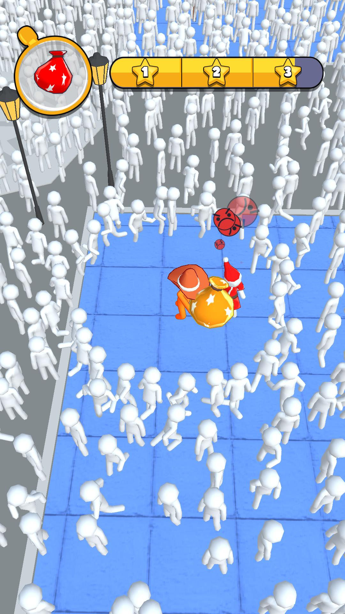

# A-Loner--development-files-
## development files only

Проект, над которым я работал в [Black Games](https://github.com/blackgames-space) (https://blackgames.space/).

Особенность проекта: использование упрощённых бойдсов (только разделение)

Геймдизайн и визуальный дизайн от людей из [Black Games](https://github.com/blackgames-space) (https://blackgames.space/), код и разработка мои.

Использует SDK: FacebookSDK, GameAnalytics, Adjust.

---

Project i worked on @ [Black Games](https://github.com/blackgames-space) (https://blackgames.space/).

Project's feature: usage of simplified boids (separation only).

Gamedesign and visual design form folks @ [Black Games](https://github.com/blackgames-space) (https://blackgames.space/), coding done by me.

Used SDKs: FacebookSDK, GameAnalytics, Adjust.

---

Preview:

https://youtu.be/y7fndBivg0Y

